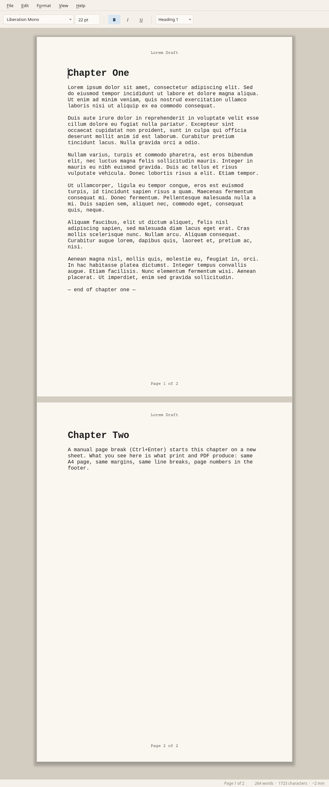

# zwriter


**Distraction-free writing** for Linux amd64 and Apple Silicon. A sibling to
[zedit](https://github.com/sbj-ee/zedit) (code editor) — not a fork — with
kinship to [FocusWriter](https://gottcode.org/focuswriter/) packaging and
vibe. Built with **C++20 + Qt 6 Widgets**.

Public repository: https://github.com/sbj-ee/zwriter

## Positioning

| | Role |
|---|---|
| **zwriter** | Long-form prose. Fullscreen hide-away chrome, themes, goals, scenes. |
| **zedit** | Code editor (syntax, LSP-minded). Different product, shared author. |
| **FocusWriter** | Inspiration for distraction-free writing UX / packaging. |
| **Word** | OUT — bureaucracy, ribbon, mail merge, track-changes theater. |

## Status

Working **v1 feature core** on a dark distraction-free `QTextEdit` surface.

### Implemented now

- **Quiet formatting toolbar** (auto-hide optional; shown by default): font family + size, **B / I / U**, and a paragraph-style dropdown (Body / Heading 1–3). Everything else — alignment, lists, tables, clear formatting — is in the Format menu
- **Paper and ink** (default) or **Dark room** theme — the whole window follows the theme (warm light chrome with a paper page, or calm charcoal); View → Theme (persisted in QSettings). Slim scrollbars, roomy menus, window size and position remembered
- **Full Page view** (default **on**) — centered paper page on a desk background at **true physical size** (mm → DIPs via logical DPI); **multi-page**: the paper grows as you write, pages are stacked with a visible break and real top/bottom margins, the window follows the caret onto the next page, and the status bar shows **Page N of M** — what you see matches print and PDF; shipping paper size **A4** (210 × 297 mm); Page Setup / print / PDF use the same page metrics; View → Full Page (Ctrl+Shift+P); off = continuous strip
- **Default body face: typewriter / Courier-class monospace at 12 pt** (`Courier New` → `Courier` → `Courier Prime` → `Nimbus Mono PS` → `Liberation Mono` → `Noto Sans Mono` → `Menlo` / `Monaco` → `DejaVu Sans Mono` → `monospace`); switch/enlarge anytime via the font picker; ODT round-trip preserves face/size; print/PDF honor fonts and match Full Page density
- **Five menus, nothing extra**: **File** (New / Open / Recent / Save / Export PDF / Print / Page Setup / Properties / Quit), **Edit** (Undo–Redo, Cut/Copy/Paste, Paste as Plain Text, Find / Replace), **Format** (B/I/U, Paragraph Style, Align, Lists, Insert Table, Table rows/columns, Insert Page Break, Page Numbers, Header & Footer, Clear Formatting), **View** (Full Page, Page Guides, Typewriter Scroll, Focus Mode, Key Sounds, Spell Check, Smart Quotes, Theme, Always Show Toolbar, Full Screen), **Help**
- **Polished native Save/Open/Export dialogs** (Qt `QFileDialog`: Documents sidebar, last-dir via QSettings, live suffix from filter, OS overwrite confirm, Create Directory/New Folder via native panel, titles “Save Document” / “Open Document” / “Export PDF”)
- **Native save default: ODT**; also open/save **TXT** and best-effort **RTF** (no proprietary `.zwriter`, no DOCX in v1). **What ODT round-trips:** text including repeated spaces, tabs and line breaks; font family/size; bold/italic/underline; Heading 1–3 (saved as `text:h` with an outline level, so they reopen as headings in zwriter and LibreOffice); alignment; bulleted/numbered/nested lists (nested levels keep their own numbering/bullet style, also from LibreOffice files); tables incl. merged cells; blank paragraphs; manual page breaks; header/footer text and document properties (meta.xml). After one save, further save/open cycles give the same document again (checked by `tests/odt_roundtrip_test`). **What does not:** text/highlight colours (dropped, so text follows the theme), images, footnotes, links, custom paragraph spacing/indents, and per-table styling — a reopened table always gets zwriter's standard border/padding, so custom table borders are lost. Opening a file never marks it modified
- **Export PDF…** (export-only — not a native edit/save format) via `QPrinter` PdfFormat
- **Print options** (lean): native OS print dialog, page setup (paper / orientation / margins; default **A4**), print preview; paper size persisted in QSettings
- **Page guides** toggle (Ctrl+Alt+G) — simple column margin guides, not a Word ruler
- **Bottom status bar** with live **word count**, **character count**, and **reading time** (~N min at 225 WPM)
- **Document Properties** (Author, Created, Last edit); in-memory always; **ODT meta.xml** round-trip best-effort
- **Typewriter scrolling** (default **on**) — caret stays vertically centered while typing/navigating
- **Focus mode** — dim everything except the current paragraph or sentence (scope in View → Focus Scope)
- **Find / Replace** — keyboard-first bar (Ctrl+F / Ctrl+H); next/prev, replace, replace all; optional match case
- **Recent files** — File → Open Recent; persisted via QSettings; stale paths cleared
- **Smart quotes / dashes** (default **off**) — curly quotes and en/em dashes from ASCII while typing
- Esc chrome pin/unpin, F11 fullscreen
- Optional typewriter key-sound toggle (**default off**) — old-manual-typewriter `key-1..6.wav` strikes (random variant per key), `space.wav` for Space/Backspace, and `return.wav` carriage slide and bell; typing/Return only (not arrow navigation)
- Typewriter icon branding
- **Tables** (QTextTable): Format → Insert Table…; Tab between cells; add/remove row or column; ODT + PDF/print
- **Header & Footer** (Format → Header & Footer…): left/center/right plain-text bands; `{page}` / `{pages}` tokens; visible in Full Page, print, and PDF; ODT meta.xml round-trip; **page numbers are opt-in and off by default** — Format → Page Numbers adds `{page}` to an empty footer band (centre first) and removes only what it added, so custom header/footer text survives an off/on cycle; drawn on every page
- **Manual page break** (Format → Insert Page Break, `Ctrl+Enter`): splits the paragraph and starts a new page; Backspace at the start of the new page removes it. Saved to ODT (`fo:break-before="page"`) and honoured in Full Page view, print and PDF
- **Spell check** (View → Spell Check, default on): Hunspell en_US live underlines; right-click suggestions / ignore / add to user dictionary; no cloud grammar
- **Help** menu: About zwriter (shows PROJECT_VERSION) + Check for Updates (GitHub releases/latest)
- CI builds + packages on Linux amd64 (`.deb`) and macOS arm64 (`.dmg`)

### Still roadmap / known limits

- Richer themes pack (beyond Paper / Dark room), autosave + restore cursor, multi-document / sessions
- Daily word / time goal, scene / chapter navigation
- Richer ODT/RTF style round-trip (colours, images, footnotes, per-table styling — reopened tables always get the standard border/padding); RTF is plain-text-oriented best-effort
- ODT Properties: body save is real; metadata is patched via `unzip`/`zip` into `meta.xml` (requires those tools). If patch fails, body still saves and a status message notes it. Headings are written as `text:h` the same way (a patch of `content.xml`); without `zip` they save as styled paragraphs and reopen as body text
- macOS `.dmg` ships the binary (not a full `.app` + macdeployqt bundle yet)
- Status extras (pages / paragraphs) — later
- Mouse-drag selection does not auto-scroll past the window edge in Full Page view (scroll, then shift-click); no widow/orphan control or keep-with-next

## v1 IN

- Fullscreen / hide-away chrome
- Quiet formatting toolbar (font family / size / B I U / paragraph style)
- **Paper-white page** default theme (dark chrome); Dark room optional
- **Full Page view** (default on) — A4 at true screen DIP size on desk (Page Setup can change size); continuous strip when off
- **Courier default body font at 12 pt** (Courier-class monospace fallbacks); user-selectable
- **Bottom status bar** with live word + character counts + **reading time**
- **Export PDF** (export-only)
- **Print** + page setup + print preview (lean; no Word-style advanced print UI)
- **Page guides** toggle
- **Document Properties** (author / created / last edit; ODT metadata best-effort)
- **ODT** native default save; **TXT** + basic **RTF** open/save
- **Optional typewriter key sounds** (toggle, default **off**; bundled `assets/sounds/key-1..6.wav` + `space.wav` + `return.wav`, synthesized by `tools/gen_typewriter_sounds.py`; Qt Multimedia / QSoundEffect)
- **Typewriter icon** branding
- **Typewriter scrolling** (toggle, default **on**)
- **Focus mode** (sentence or paragraph scope)
- **Find and replace** (Ctrl+F / Ctrl+H)
- **Recent files** menu (QSettings)
- **Smart quotes / dashes** (toggle, default **off**)
- **Help → About** + **Check for Updates** (GitHub latest release)
- **Tables** (insert, edit cells, add/remove row/column; ODT round-trip)
- **Header & Footer** + opt-in page numbers (`{page}` / `{pages}`; off by default)
- **Spell check** (Hunspell en_US; toggle; context suggestions)
- Themes (Paper default + Dark room; fuller packs later)
- Autosave + restore cursor
- Multi-document / sessions
- Daily word / time goal
- Scene / chapter navigation

## v1 OUT

- Mail merge / booklet / watermark print theater
- Track-changes
- SmartArt
- Template marketplace
- Cloud collab
- Ribbon UI
- Plugin marketplace
- Proprietary `.zwriter` format
- DOCX (not required for v1)
- Full Word Document Properties dump
- Per-theme locked font packs / downloadable font store
- OpenType feature UI
- Word-style style gallery

## Screenshots

Full Page view with two true-size A4 sheets and a manual page break (more in
[`docs/screenshots/`](docs/screenshots/README.md)):



## Formats

| Role | Formats |
|---|---|
| **Native default save** | ODT (OpenDocument Text) |
| **Also open / save** | TXT, basic RTF (best-effort) |
| **Export only** | PDF |
| **Not in v1** | DOCX, proprietary `.zwriter` |

ODT open uses `unzip` to read `content.xml` / `meta.xml` (Linux + macOS). Prefer ODT for fidelity; RTF is readable interchange.

## Version bumps

**One place only:** the `VERSION` argument of `project()` in the top-level
`CMakeLists.txt`. That value becomes `PROJECT_VERSION`, generates
`version.hpp` for the app, and feeds CPack artifact names. Do not hand-edit
a version header.

```cmake
project(zwriter VERSION 0.1.0 LANGUAGES CXX)  # example bump
```

Semver `MAJOR.MINOR.PATCH`. GitHub Release tags: `vX.Y.Z`. Artifacts:
`zwriter-X.Y.Z-Linux-amd64.deb`, `zwriter-X.Y.Z-Darwin.dmg`.

## Build

Platforms: **Linux amd64** and **Apple Silicon (arm64)** only. No Windows, no
Intel Mac.

### Linux

```bash
sudo apt-get update
sudo apt-get install -y qt6-base-dev cmake ninja-build g++ unzip zip \
  libhunspell-dev hunspell-en-us
# optional, for live key sounds:
# sudo apt-get install -y qt6-multimedia-dev

cmake -B build -G Ninja
cmake --build build
./build/zwriter

# ODT round-trip test (needs unzip + zip; add -DZWRITER_BUILD_TESTS=OFF to skip):
ctest --test-dir build --output-on-failure

# package .deb (optional):
cd build && cpack -G DEB
```

**Dock / taskbar icon when running from the build tree.** The icon is embedded in
the binary and the window announces the app id `zwriter`, but GNOME and other
desktops take the dock icon and hover name from a `zwriter.desktop` entry. A
`.deb` install provides one; for `./build/zwriter` run:

```bash
tools/install-desktop-entry.sh            # registers build/zwriter (per-user, no sudo)
tools/install-desktop-entry.sh --remove   # undo
```

`qt6-base-dev` already pulls in Widgets + PrintSupport (PDF export + print).

### macOS (Apple Silicon)

```bash
brew install qt cmake ninja hunspell
cmake -B build -G Ninja -DCMAKE_PREFIX_PATH="$(brew --prefix qt)"
cmake --build build
./build/zwriter

# package .dmg (optional):
cd build && cpack -G DragNDrop
```

`CMakeLists.txt` forces `CMAKE_OSX_ARCHITECTURES=arm64` on Darwin before
`project()` (same pattern as zedit). Multimedia and Hunspell remain optional
(spell check enables when Hunspell + en_US dict are present).

### Shortcuts

| Key | Action |
|---|---|
| `Esc` | Close find bar if open; else toggle always-show / hide-away chrome (default: always shown; also View → Always Show Toolbar) |
| Mouse near top / bottom | Temporarily reveal chrome when hide-away is on |
| `F11` | Fullscreen |
| `Ctrl+O` / `Ctrl+S` / `Ctrl+Shift+S` | Open / Save / Save As (default filter ODT) |
| `Ctrl+F` / `Ctrl+H` | Find / Replace |
| `F3` / `Shift+F3` | Find next / previous |
| `Ctrl+B` / `Ctrl+I` / `Ctrl+U` | Bold / italic / underline |
| `Ctrl+Alt+0` … `3` | Body text / Heading 1–3 |
| `Ctrl+L` / `Ctrl+E` / `Ctrl+R` / `Ctrl+J` | Align left / center / right / justify |
| `Ctrl+Shift+B` / `Ctrl+Shift+N` | Bulleted / numbered list |
| `Ctrl+\` | Clear formatting |
| `Ctrl+N` | New document |
| `Ctrl+Shift+V` | Paste as plain text |
| `Ctrl+Alt+G` | Toggle page guides |
| `Ctrl+Enter` | Insert page break |
| `Ctrl+Shift+P` | Toggle Full Page view (default on) |
| `PgUp` / `PgDn` | Move by one window in Full Page view (Shift extends selection) |
| `Ctrl+Shift+E` | Export PDF… |
| `Ctrl+P` | Print… |
| `Ctrl+Shift+T` | Toggle typewriter scroll (default on) |
| `Ctrl+Shift+F` | Toggle focus mode |
| `Ctrl+Shift+K` | Toggle typewriter key sounds (default off; also View → Typewriter Key Sounds) |
| `Ctrl+Shift+I` | Insert table… |
| `Tab` / `Shift+Tab` | Next / previous table cell |

## License

MIT — Copyright (c) 2026 Stephen B. Johnson. See [LICENSE](LICENSE).

## Icon

Classic **typewriter** silhouette (`assets/icons/zwriter.svg` /
`zwriter-128.png`) — not a Word-like W, not a fountain pen.
